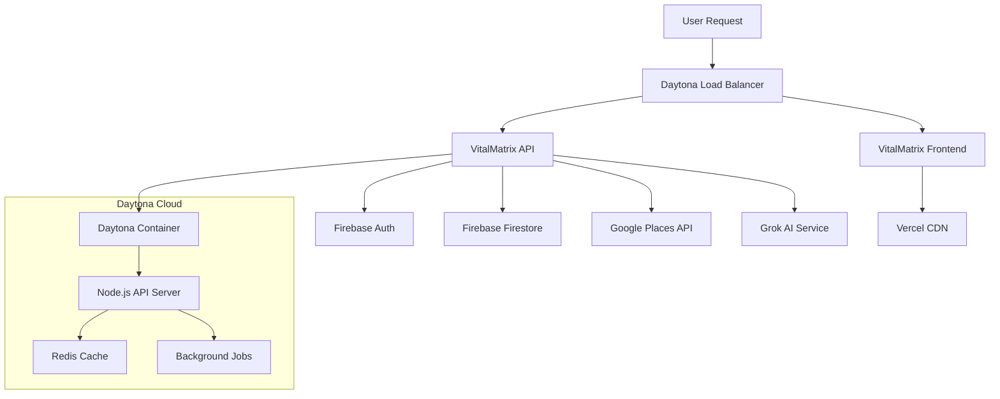

# ☁️ Daytona Cloud Integration

VitalMatrix leverages Daytona's cloud development platform for scalable deployment, development environments, and production infrastructure.

## 🏗️ **Development Status**

<Warning>
**Under Construction**: Daytona deployment is being configured for production-ready API hosting.
</Warning>

### ✅ **Completed**
- Initial Daytona workspace setup
- Development environment configuration
- Basic deployment pipeline

### 🚧 **In Progress**
- Production API deployment
- Auto-scaling configuration
- CI/CD pipeline integration
- Environment variable management

## 🚀 **Deployment Architecture**

### Current Setup

```yaml
# Daytona Workspace Configuration
apiVersion: v1
kind: Workspace
metadata:
  name: vitalmatrix-production
spec:
  image: node:18-alpine
  resources:
    cpu: "2"
    memory: "4Gi"
    storage: "20Gi"
  ports:
    - name: frontend
      port: 3000
      protocol: HTTP
    - name: api
      port: 3001
      protocol: HTTP
  environment:
    - name: NODE_ENV
      value: "production"
    - name: FIREBASE_PROJECT_ID
      valueFrom:
        secretKeyRef:
          name: firebase-config
          key: project-id
```

### Planned Production Architecture



## 🛠️ **Development Environment**

### Workspace Setup

```bash
# Create new Daytona workspace
daytona create workspace vitalmatrix \
  --image node:18-alpine \
  --cpu 2 \
  --memory 4Gi \
  --storage 20Gi

# Clone VitalMatrix repository
git clone https://github.com/JoeProAI/VitalMatrix.git
cd VitalMatrix

# Install dependencies
npm install

# Start development servers
npm run dev        # Frontend on port 3000
npm run api:dev    # API server on port 3001
```

### Environment Configuration

```typescript
// daytona.config.ts
export interface DaytonaConfig {
  workspace: {
    name: string;
    image: string;
    resources: {
      cpu: string;
      memory: string;
      storage: string;
    };
  };
  services: {
    frontend: {
      port: number;
      command: string;
      healthCheck: string;
    };
    api: {
      port: number;
      command: string;
      healthCheck: string;
    };
  };
  environment: Record<string, string>;
}

const config: DaytonaConfig = {
  workspace: {
    name: 'vitalmatrix-prod',
    image: 'node:18-alpine',
    resources: {
      cpu: '4',
      memory: '8Gi',
      storage: '50Gi'
    }
  },
  services: {
    frontend: {
      port: 3000,
      command: 'npm run build && npm run start',
      healthCheck: '/health'
    },
    api: {
      port: 3001,
      command: 'npm run api:start',
      healthCheck: '/api/health'
    }
  },
  environment: {
    NODE_ENV: 'production',
    API_BASE_URL: 'https://api.vitalmatrix.daytona.io',
    FRONTEND_URL: 'https://vitalmatrix.daytona.io'
  }
};
```

## 📡 **API Deployment**

### Production API Endpoints

<Info>
**Coming Soon**: Full API deployment to Daytona cloud infrastructure.
</Info>

```typescript
// Production API base URLs
const DAYTONA_ENDPOINTS = {
  production: 'https://api.vitalmatrix.daytona.io',
  staging: 'https://staging-api.vitalmatrix.daytona.io',
  development: 'https://dev-api.vitalmatrix.daytona.io'
};

// API service configuration
interface APIServiceConfig {
  baseUrl: string;
  timeout: number;
  retries: number;
  rateLimit: {
    requests: number;
    window: number;
  };
}

const productionConfig: APIServiceConfig = {
  baseUrl: DAYTONA_ENDPOINTS.production,
  timeout: 30000,
  retries: 3,
  rateLimit: {
    requests: 1000,
    window: 3600000 // 1 hour
  }
};
```

### Service Deployment

```dockerfile
# Dockerfile for Daytona deployment
FROM node:18-alpine

WORKDIR /app

# Copy package files
COPY package*.json ./
RUN npm ci --only=production

# Copy application code
COPY . .

# Build application
RUN npm run build

# Expose ports
EXPOSE 3000 3001

# Health check
HEALTHCHECK --interval=30s --timeout=3s --start-period=5s --retries=3 \
  CMD curl -f http://localhost:3001/api/health || exit 1

# Start services
CMD ["npm", "run", "start:production"]
```

### Deployment Script

```bash
#!/bin/bash
# deploy-to-daytona.sh

set -e

echo "🚀 Deploying VitalMatrix to Daytona..."

# Build application
echo "📦 Building application..."
npm run build

# Create deployment package
echo "📋 Creating deployment package..."
tar -czf vitalmatrix-$(date +%Y%m%d-%H%M%S).tar.gz \
  --exclude=node_modules \
  --exclude=.git \
  --exclude=docs \
  .

# Deploy to Daytona
echo "☁️ Deploying to Daytona workspace..."
daytona workspace deploy vitalmatrix-production \
  --package vitalmatrix-*.tar.gz \
  --env-file .env.production

# Verify deployment
echo "✅ Verifying deployment..."
curl -f https://api.vitalmatrix.daytona.io/health || {
  echo "❌ Deployment verification failed"
  exit 1
}

echo "🎉 Deployment successful!"
```

## 🔧 **Configuration Management**

### Environment Variables

```bash
# .env.production (Daytona)
NODE_ENV=production
PORT=3001
API_PORT=3001

# Firebase Configuration
FIREBASE_PROJECT_ID=vitalmatrix-prod
FIREBASE_API_KEY=your_api_key
FIREBASE_AUTH_DOMAIN=vitalmatrix-prod.firebaseapp.com

# Google Services
GOOGLE_MAPS_API_KEY=your_google_maps_key
GOOGLE_PLACES_API_KEY=your_google_places_key

# AI Services
GROK_AI_API_KEY=your_grok_api_key
GROK_AI_ENDPOINT=https://api.grok.ai/v1

# External Services
OPENFOODFACTS_API_URL=https://world.openfoodfacts.org/api/v0

# Monitoring & Analytics
SENTRY_DSN=your_sentry_dsn
ANALYTICS_ID=your_analytics_id

# Security
JWT_SECRET=your_jwt_secret
CORS_ORIGIN=https://vitalmatrix.joepro.ai
```

### Secrets Management

```typescript
// secrets.config.ts
interface SecretsConfig {
  firebase: {
    projectId: string;
    privateKey: string;
    clientEmail: string;
  };
  apis: {
    googleMaps: string;
    grokAI: string;
    openFoodFacts: string;
  };
  security: {
    jwtSecret: string;
    encryptionKey: string;
  };
}

// Load secrets from Daytona secret store
const loadSecrets = async (): Promise<SecretsConfig> => {
  const secrets = await daytona.secrets.get('vitalmatrix-secrets');
  
  return {
    firebase: {
      projectId: secrets.FIREBASE_PROJECT_ID,
      privateKey: secrets.FIREBASE_PRIVATE_KEY,
      clientEmail: secrets.FIREBASE_CLIENT_EMAIL
    },
    apis: {
      googleMaps: secrets.GOOGLE_MAPS_API_KEY,
      grokAI: secrets.GROK_AI_API_KEY,
      openFoodFacts: secrets.OPENFOODFACTS_API_KEY
    },
    security: {
      jwtSecret: secrets.JWT_SECRET,
      encryptionKey: secrets.ENCRYPTION_KEY
    }
  };
};
```

## 📊 **Monitoring & Observability**

### Health Checks

```typescript
// health.controller.ts
import { Request, Response } from 'express';

export class HealthController {
  async checkHealth(req: Request, res: Response) {
    const health = {
      status: 'healthy',
      timestamp: new Date().toISOString(),
      version: process.env.npm_package_version,
      environment: process.env.NODE_ENV,
      services: {
        database: await this.checkDatabase(),
        firebase: await this.checkFirebase(),
        googlePlaces: await this.checkGooglePlaces(),
        grokAI: await this.checkGrokAI()
      },
      resources: {
        memory: process.memoryUsage(),
        uptime: process.uptime(),
        cpu: process.cpuUsage()
      }
    };

    const allHealthy = Object.values(health.services).every(
      service => service.status === 'healthy'
    );

    res.status(allHealthy ? 200 : 503).json(health);
  }

  private async checkDatabase() {
    try {
      // Check database connectivity
      return { status: 'healthy', responseTime: 45 };
    } catch (error) {
      return { status: 'unhealthy', error: error.message };
    }
  }

  // Additional service checks...
}
```

### Performance Metrics

```typescript
// metrics.service.ts
interface PerformanceMetrics {
  apiResponseTime: number;
  databaseQueryTime: number;
  aiProcessingTime: number;
  errorRate: number;
  throughput: number;
}

class MetricsService {
  async collectMetrics(): Promise<PerformanceMetrics> {
    return {
      apiResponseTime: await this.measureApiResponseTime(),
      databaseQueryTime: await this.measureDatabaseTime(),
      aiProcessingTime: await this.measureAIProcessingTime(),
      errorRate: await this.calculateErrorRate(),
      throughput: await this.calculateThroughput()
    };
  }

  async sendToDaytona(metrics: PerformanceMetrics) {
    // Send metrics to Daytona monitoring
    await daytona.metrics.send('vitalmatrix', metrics);
  }
}
```

## 🔄 **CI/CD Pipeline**

### GitHub Actions Integration

```yaml
# .github/workflows/deploy-daytona.yml
name: Deploy to Daytona

on:
  push:
    branches: [main]
  pull_request:
    branches: [main]

jobs:
  test:
    runs-on: ubuntu-latest
    steps:
      - uses: actions/checkout@v3
      - uses: actions/setup-node@v3
        with:
          node-version: '18'
      - run: npm ci
      - run: npm test
      - run: npm run build

  deploy:
    needs: test
    runs-on: ubuntu-latest
    if: github.ref == 'refs/heads/main'
    steps:
      - uses: actions/checkout@v3
      - name: Deploy to Daytona
        env:
          DAYTONA_TOKEN: ${{ secrets.DAYTONA_TOKEN }}
        run: |
          curl -X POST https://api.daytona.io/deploy \
            -H "Authorization: Bearer $DAYTONA_TOKEN" \
            -H "Content-Type: application/json" \
            -d '{
              "workspace": "vitalmatrix-production",
              "repository": "${{ github.repository }}",
              "branch": "${{ github.ref_name }}",
              "commit": "${{ github.sha }}"
            }'
```

## 🚨 **Error Handling & Recovery**

### Automatic Recovery

```typescript
// recovery.service.ts
class RecoveryService {
  async handleServiceFailure(serviceName: string, error: Error) {
    console.error(`Service ${serviceName} failed:`, error);

    // Attempt automatic recovery
    switch (serviceName) {
      case 'database':
        await this.restartDatabaseConnection();
        break;
      case 'ai-service':
        await this.fallbackToBasicRecommendations();
        break;
      case 'google-places':
        await this.useCachedFacilityData();
        break;
    }

    // Notify monitoring
    await daytona.alerts.send({
      level: 'error',
      service: serviceName,
      message: error.message,
      timestamp: new Date()
    });
  }
}
```

---

<Note>
**Deployment Timeline**: VitalMatrix Daytona deployment is scheduled for completion by end of hackathon. Core functionality will be migrated from Vercel to Daytona for enhanced scalability and performance.
</Note>

## 🔗 **Related Documentation**

- [API Overview](/api-reference/overview) - Complete API reference
- [Authentication](/api-reference/authentication) - Security and access control
- [Google Places Integration](/api-reference/integrations/google-places) - Location services
- [Firebase Integration](/api-reference/integrations/firebase) - Database and auth services
